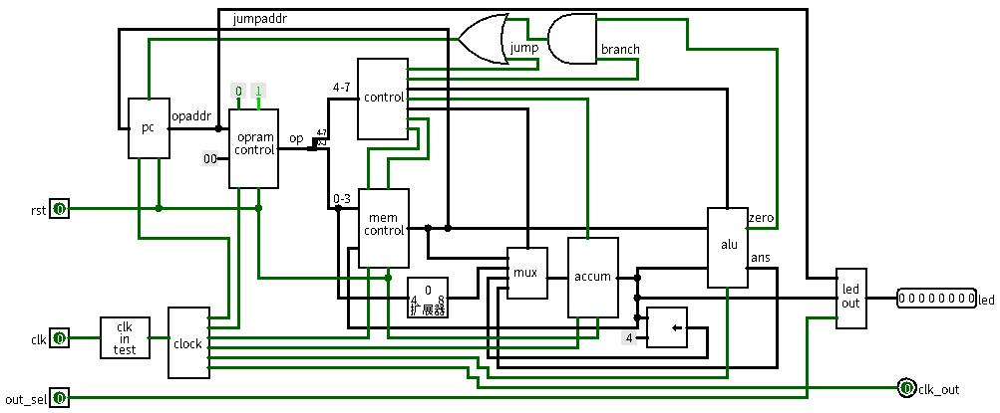

# GCore  

---

#### A simple RISC CPU on Lichee Nano FPGA  

##### Version:0.3.6 Beta 

---

---

## OP list  

| OP    | Bin   | Hex  |
| ----- | ----- | ---- |
| NOP   | 0000  | 0    |
| JUMP  | 0001  | 1    |
| SAVE  | 0010  | 2    |
| LOAD  | 0011  | 3    |
| LOADI | 0100  | 4    |
| SLL   | 0101  | 5    |
| ADD   | 1000  | 8    |
| SUB   | 1001  | 9    |
| AND   | 1010A | A    |
| OR    | 1011  | B    |
| XOR   | 1100  | C    |
| SLT   | 1110  | E    |
| BZ    | 1111  | F    |

---

## To Do  
Clock     
