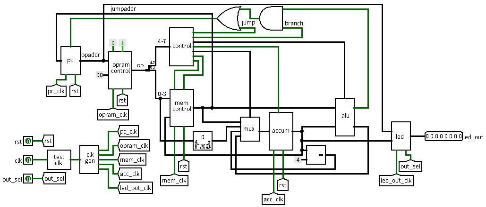

# GCore  

---

#### 基于Tang Nano FPGA的极简RISC CPU

##### Version:0.3.6 Beta 

项目地址：<https://github.com/wallfacerlogic/GCore>

---

> 在处理器发展的同时，可编程逻辑器件也在持续发展。可编程逻辑器件不仅带来了技术的革新，也带来了观念的革新、设计流程的更新。如今通过编写代码就可在可编程逻辑器件上实现非常复杂的电路设计，于是普通大众终于有机会了解CPU的实现原理，甚至自己设计！

## GCore结构图



---

## CPU参数

* 主频24MHz(理论最高130MHz)，测试时8Hz(1s完成一次指令)
* 使用129 LUTs, 16 ALUs，板载占用仅13%
* 内置 16 x 8 SRAM内存
* 最多存储256条汇编指令
* 总功耗4.422mW，待机功耗2.807mW
* 无流水线无多发单核心单线程

---


## FPGA简介

FPGA 属于专用集成电路中的一种半定制电路。芯片里面有非常多的查找表，通过这些查找表的组合，可实现或与非等数字逻辑。还有时钟模块以实现时序，寄存器模块存储电路状态，RAM模块存储大量数据。**是一种可多次重写来改变内部电路结构的芯片。**

---


## 部分术语说明

* FPGA：现场可编程门阵列
* LUT：查找表，FPGA里最基本单位
* PC：指令寄存器
* OP：CPU指令
* ACCUM：累加器
* ALU：算数逻辑单元
* Imm：立即数

---

## OP格式

* 高4位：OP
* 低4位：内存地址（LOADI时为立即数）

---

## OP表  

| OP    | Bin   | Hex  | 含义          |
| ----- | ----- | ---- | ------------- |
| NOP   | 0000  | 0    |               |
| JUMP  | 0001  | 1    | PC=M          |
| SAVE  | 0010  | 2    | M=A           |
| LOAD  | 0011  | 3    | A=M           |
| LOADI | 0100  | 4    | A=Imm         |
| SLL   | 0101  | 5    | A=A<<4        |
| ADD   | 1000  | 8    | A=A+M         |
| SUB   | 1001  | 9    | A=A-M         |
| AND   | 1010A | A    | A=A&M         |
| OR    | 1011  | B    | A=A\|M        |
| XOR   | 1100  | C    | A=A^M         |
| SLT   | 1110  | E    | A<B?1:0       |
| BZ    | 1111  | F    | if(A==0):PC=M |

---

## CPU时序

* T1：PC输出
* T2：OPRAM取指，Control译指
* T3：Memory取数
* T4：Memory、ACCUM存数，PC更新
* T5：暂无
* T6：暂无
* T7：暂无
* T8：LED输出

---

## 测试程序

```
// File_format=Bin
// Address_depth=256
// Data_width=8

// 加载立即数110（跳转地址）
01000110
// 存110到寄存器0000
00100000
// 加载立即数1
01000001
// 存1到寄存器0001
00100001
// 加载立即数10
01000010
// 存10到寄存器0010
00100010

// 主循环
// 空指令
00000000
// 加载立即数1
01000001
// 加寄存器0001
// 1+1=10
10000001
// 加寄存器0010
// 10+10=100
10000010
// 跳转至寄存器0000
00010000
```


---

## To Do

* 全面测试
* 增加流水线
* 支持更多寄存器
* 增加主线
